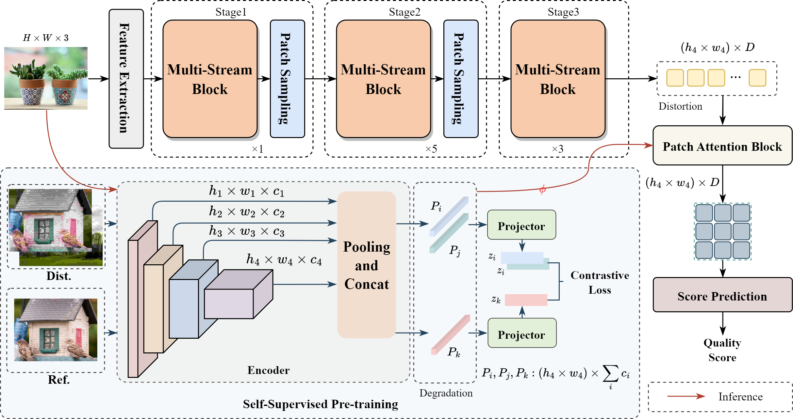

## Transformer-Based No-Reference Image Quality Assessment via Supervised Contrastive Learning (AAAI 2024)

[Paper](https://arxiv.org/abs/2312.06995)

 

## Environment
  

> $ pip install -r  requirements.txt 
> 
> $ conda env create -f environment.yaml

## Datasets

In this work we use 6 datasets ([LIVE](https://live.ece.utexas.edu/research/quality/subjective.htm), [CSIQ](http://vision.eng.shizuoka.ac.jp/mod/page/view.php?id=23), [TID2013](http://www.ponomarenko.info/tid2013.htm), [KADID10K](http://database.mmsp-kn.de/kadid-10k-database.html), [LIVE challenge](https://live.ece.utexas.edu/research/ChallengeDB/), [KonIQ](http://database.mmsp-kn.de/koniq-10k-database.html), [LIVEFB](https://baidut.github.io/PaQ-2-PiQ/))

## Training

1. SCL pre-training. 

   ```python
   $ python train_scl.py
   ```

2. Final model for score prediction.

   ``` python
   $ python train.py
   ```


## Citation
If our work is useful for your research, please consider citing:

    @inproceedings{shi2023transformer,
        author = {Shi, Jinsnog and Pan, Gao and Qin Jie},
        title = {Transformer-Based No-Reference Image Quality Assessment via Supervised Contrastive Learning},
        booktitle = {AAAI},
        year = {2024}
    }

